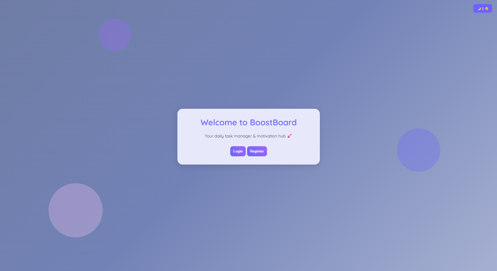
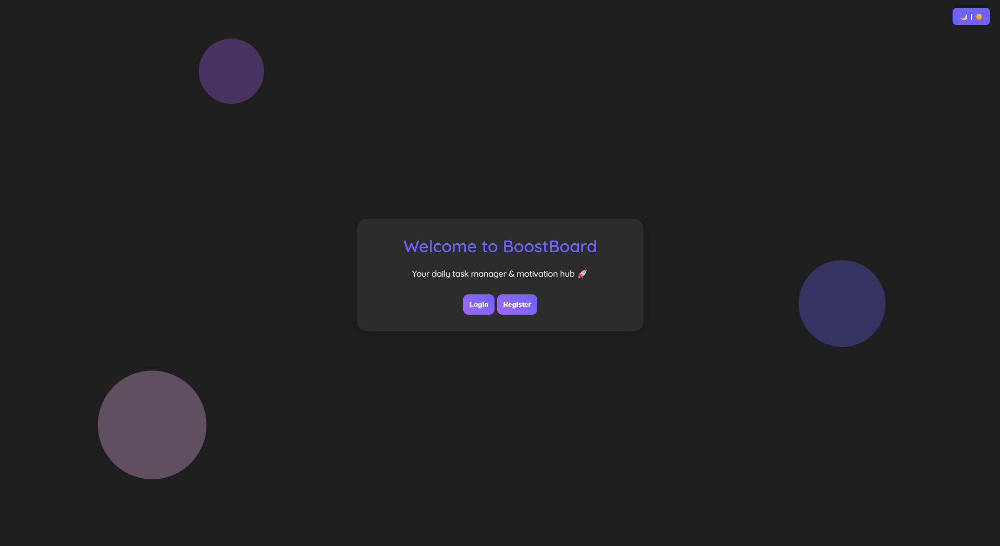

# 📌 Daily Task & Motivation Board

A simple web-based CRUD application to manage daily tasks and track productivity, enhanced with motivational quotes and a dark mode toggle for better user experience.

## 📖 Project Overview

Many individuals struggle with productivity and task management due to a lack of personal motivation and structured systems. This application was designed to help users stay productive by providing an intuitive task management board combined with daily motivational quotes. The goal is to improve personal discipline while offering a positive user experience.

## 🚀 Technologies Used

- **Python (Flask)** — backend framework
- **SQLite** — database
- **HTML5** — markup language
- **CSS3** — styling
- **JavaScript (vanilla)** — client-side interaction
- **jQuery** — for AJAX task search
- **ZenQuotes API** — for daily motivational quotes
- **Railway** — deployment

## ✨ Features

- ✅ User authentication (register & login)
- ✅ Add, view, edit, delete tasks (CRUD)
- ✅ Task category tagging: Urgent / Important / Normal with colored badges
- ✅ Live progress tracker (tasks completed vs total)
- ✅ Task search via keyword (AJAX)
- ✅ Motivational quote of the day (API integration)
- ✅ Dark mode / light mode toggle (persistent via localStorage)
- ✅ Responsive design for desktop & mobile
- ✅ Animated background bubbles and modern UI

## 🤖 AI Support Explanation

During the development phase, AI (IBM Granite) was used to:
- Refactor JavaScript for the dark mode toggle and AJAX search
- Suggest SQLAlchemy query structures for task sorting by category priority
- Generate API integration methods for motivational quotes

The AI tools were exclusively used during the **development and documentation phase** to speed up coding, improve code structure, and increase productivity.

## 📝 Setup Instructions

1. Clone the repository:

2. Install dependencies:

3. Run the Flask app:

4. Open `http://localhost:5000` in your browser.

## 🌐 Deployment Link

[Live Application Here](https://your-app-deployment-link.com)

---

## 📸 Screenshots

| Dashboard | Dark Mode |
|:-------------|:------------|
|  |  |

